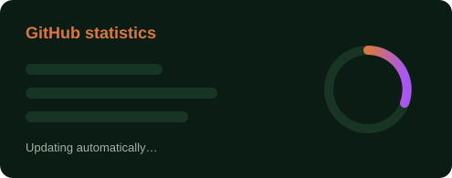
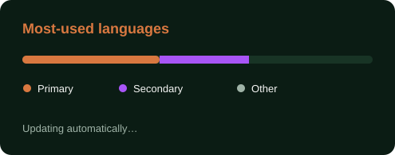
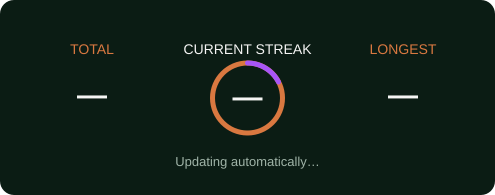

<div align="center">



<br />

<a href="https://git.io/typing-svg">
  
</a>

<p>
  <a href="https://linkedin.com/in/josiane-uwumukiza"></a>
  <a href="https://github.com/JosianeUwumukiza"></a>
  <a href="https://josianeuwumukiza.github.io/Academic-portfolio/"></a>
</p>

</div>

## About me

I'm a Computer Science student at **Wellesley College**, cross-registered at **MIT**, with interests spanning machine learning, computer vision, and scientific systems. My experience ranges from probabilistic models to deep learning architectures, alongside full-stack and mobile development.

I’m happiest in environments where I can keep learning, ask ambitious questions, and turn ideas into useful, thoughtfully engineered systems. Away from the screen, I’m learning piano and writing poetry and prose.

## Currently

```text
🔭  Computer vision and AI research       MIT ARC Lab + MIT Media Lab
💻  Software Engineering Intern           Microsoft · Summer 2025
🧠  Exploring                             Intelligent perception + scientific systems
🎹  Beyond code                           Piano · poetry · prose
```

## Toolbox

<div align="center">


</div>

## GitHub at a glance

<div align="center">




<br />



<br />


</div>

## What I care about

<table>
  <tr>
    <td width="50%" valign="top">
      <h3>🔬 Research</h3>
      <p>I work across AI, computer vision, and scientific systems, with a focus on intelligent perception and high-impact technical problems.</p>
    </td>
    <td width="50%" valign="top">
      <h3>🛠️ Engineering</h3>
      <p>I enjoy building end-to-end: models, systems, pipelines, and products that are technically rigorous and genuinely useful.</p>
    </td>
  </tr>
</table>

<div align="center">

### Let’s build something meaningful.

<sub>Research · engineering · curiosity</sub>

</div>
